<div align="center">


# Santora

**A proper music player for Minecraft's own soundtrack.**

Browse every track as albums, by artist, or by update. Queue it, shuffle it, crossfade it,
and keep it playing wherever you go.

<br />


[](LICENSE)

<br />

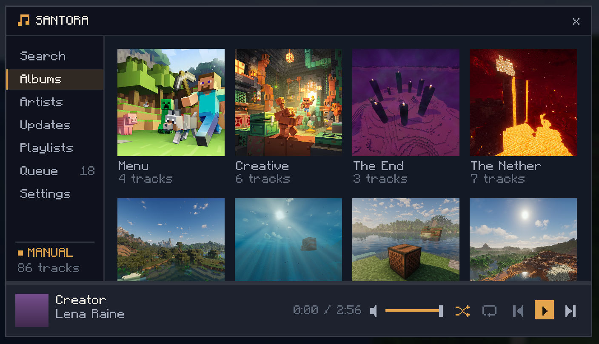

</div>

---

## Features

- **The whole soundtrack, organized**: browse by album, artist, or Minecraft update, or just search.
- **Queue & playlists**: build a lineup, drag to reorder, save your own playlists, favorite what you love.
- **Smooth playback**: crossfade tracks into each other, tune fade length, add a delay between songs.
- **Now Playing HUD**: a draggable overlay that shows the current track anywhere on screen.
- **Listen together**: start a party, share a code, and everyone hears the same music in sync.
- **Make it yours**: pick a background and accent color, and dial the menu's opacity to see the game through it.
- **Follows you everywhere**: keeps playing across dimensions, deaths, and world swaps.

---

## Browse the soundtrack

Minecraft's soundtrack has grown huge. Santora lays the whole thing out four different ways so you
can always find what you're after.

<table>
  <tr>
    <td width="50%">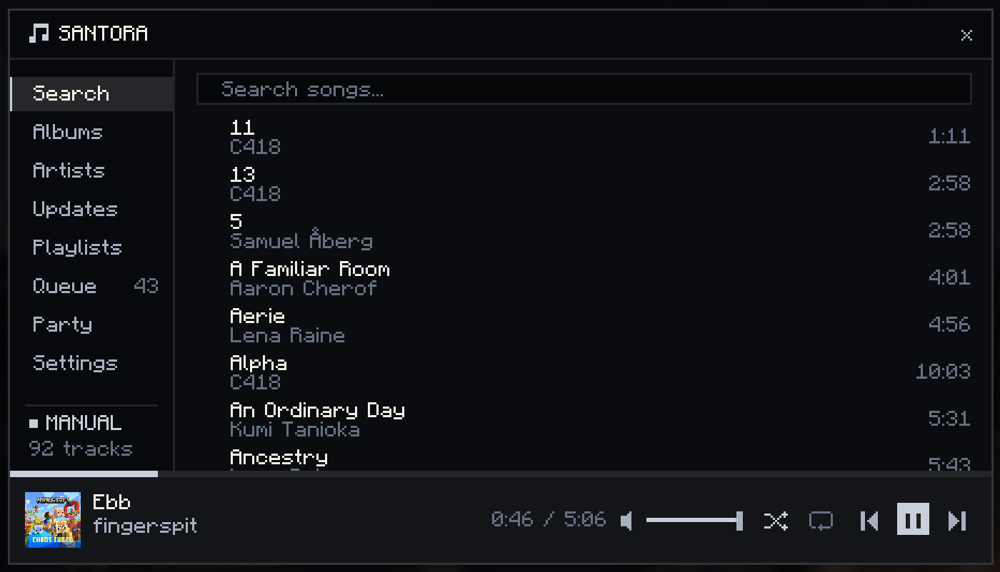</td>
    <td width="50%">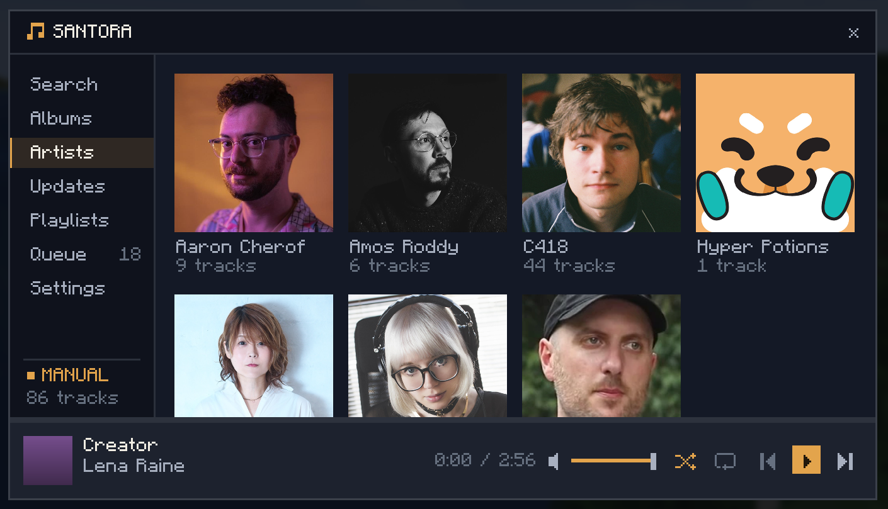</td>
  </tr>
  <tr>
    <td align="center"><b>Search</b>: type to filter across every song instantly</td>
    <td align="center"><b>Artists</b>: Browse by the artists that created the songs</td>
  </tr>
  <tr>
    <td width="50%">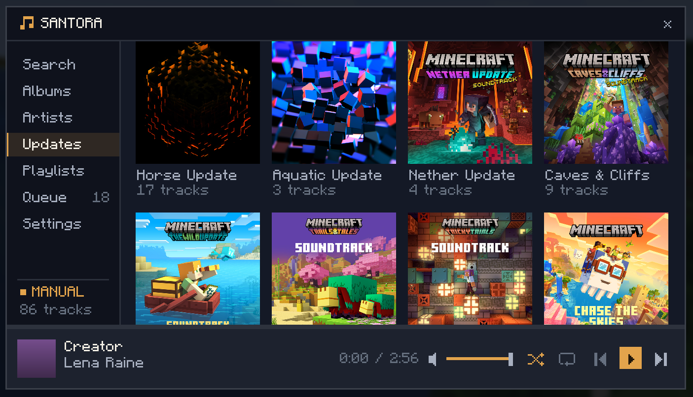</td>
    <td width="50%">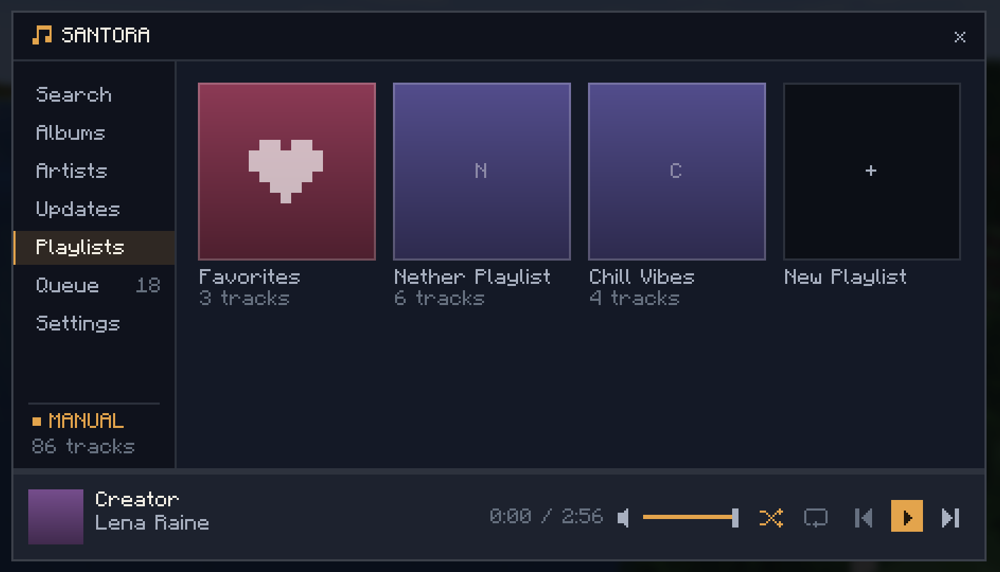</td>
  </tr>
  <tr>
    <td align="center"><b>Updates</b>: grouped by which update the songs release with</td>
    <td align="center"><b>Playlists</b>: Favorites plus any custom playlists you want</td>
  </tr>
</table>

---

## Queue it up

Line up what plays next, drag tracks to reorder them and favorite the ones you love

<div align="center">
  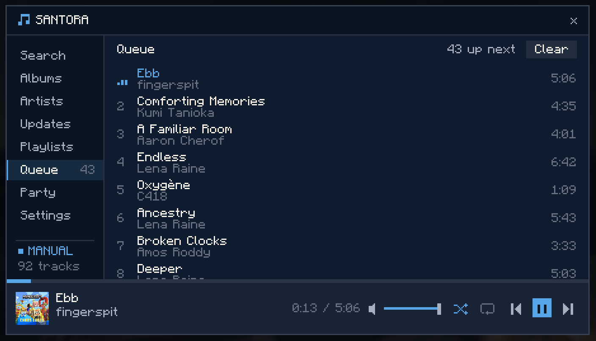
</div>

---

## Listen together

Start a party and everyone hears the **same music, in sync**. Anyone can add tracks to the
shared queue and set their own volume, while the host stays in charge of skipping and pausing.

Open **Party**, hit **Host party**, and share the code. Friends paste it into **Join** and
they're listening along, on any server or world.

---

## Now Playing HUD

Turn on the overlay to keep the current track on screen while you play. Album art, title, artist, and a live progress bar. Drag it anywhere you like and it stays put.

<table>
  <tr>
    <td>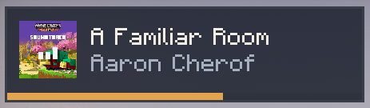</td>
    <td>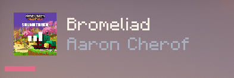</td>
  </tr>
</table>

---

## Make it yours

Set a background and accent color, then slide the opacity down to let the world show through the menu. The whole UI recolors to match.

<table>
  <tr>
    <td width="50%">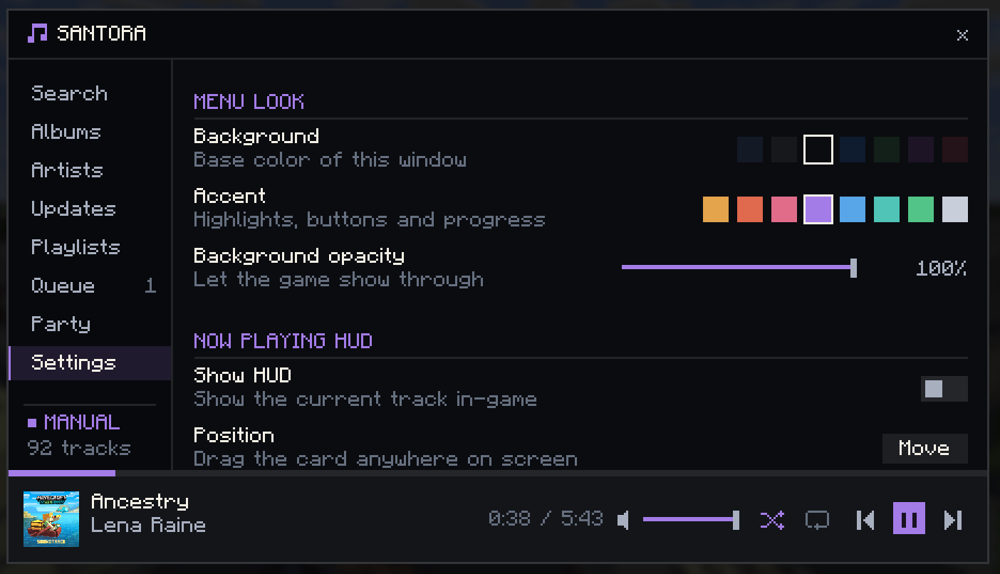</td>
    <td width="50%">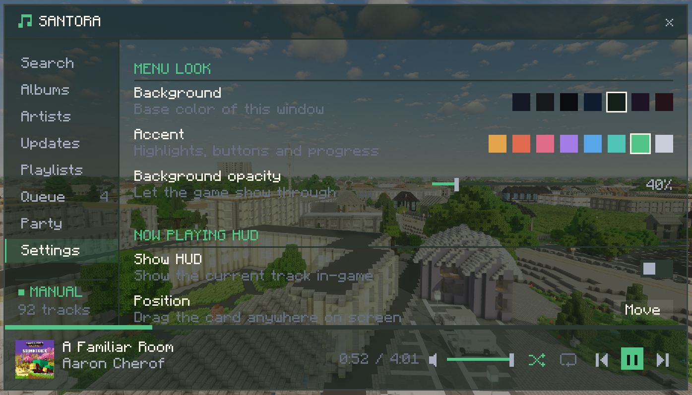</td>
  </tr>
  <tr>
    <td align="center">Background, accent, and HUD colors</td>
    <td align="center">Menu opacity turned down to 30%</td>
  </tr>
</table>

---

## Playback

Crossfade every track into the next, set how long the blend lasts, add a gap between songs, and
control Santora's volume independently of the rest of the game.

<div align="center">
  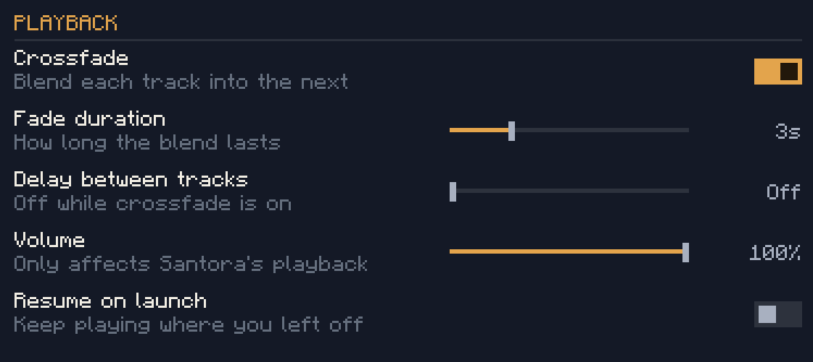
</div>

---

## Install

1. Install **Fabric Loader** for your Minecraft version.
2. Install **[Fabric API](https://modrinth.com/mod/fabric-api)**.
3. Download the latest release and drop it into your mods folder.
4. Launch the game and press **M** to open the player.

---

## Build it yourself

```bash
./gradlew buildAll          # both targets → dist/mc<version>/
./gradlew :v262:build       # just 26.2
./gradlew :v1211:build      # just 1.21.11
```

As of now Santora only works on **1.21.11** and **26.2**, more versions will be supported in the future.

---


## License

Released under the [MIT License](LICENSE).
